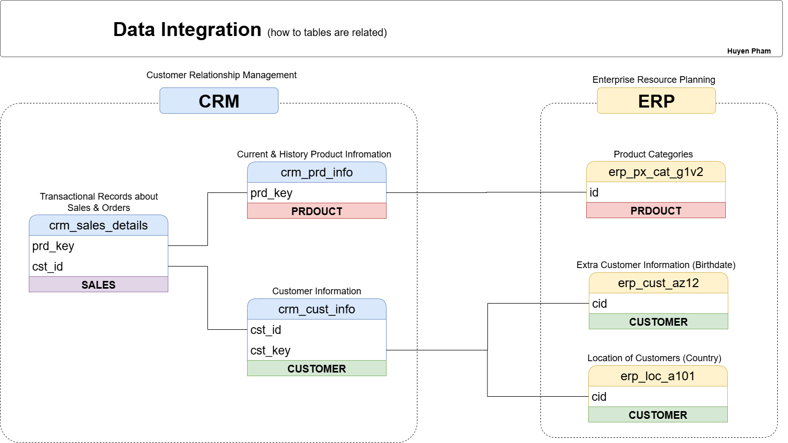

# Data Warehouse and Analytics Project

Welcome to the **Data Warehouse and Analytics Project** repository! 🚀  
This project demonstrates a comprehensive data warehousing and analytics solution, from building a data warehouse to generating actionable insights. It highlights industry best practices in data engineering and analytics.
It covers the full lifecycle — from ingesting raw data to delivering actionable business insights.
---

## 🏢 Business Context

A mid-size retail company needs to integrate data from its **ERP (sales and inventory) and CRM (customer interactions)** systems to enable unified, data-driven decision-making.

The business goals are:

- **Single Source** of Truth for sales, customer, and product performance data.

- **Improved Sales Insights** to identify high-value customers and top-performing products.

- **Data Quality Assurance** to ensure clean, standardized, and analytics-ready data.

This project simulates such an environment, ingesting ERP and CRM datasets in **CSV format** and transforming them into a **star schema** for analytics and reporting.

---
## 🏗️ Data Architecture & Diagrams
### Data Architecture Diagrams

The data architecture for this project follows Medallion Architecture **Bronze**, **Silver**, and **Gold** layers:
.png)

1. **Bronze Layer**: Stores raw data as-is from the source systems. Data is ingested from CSV Files into SQL Server Database.
2. **Silver Layer**: This layer includes data cleansing, standardization, and normalization processes to prepare data for analysis.
3. **Gold Layer**: Houses business-ready data modeled into a star schema required for reporting and analytics.
### Data Flow Diagram
.png)
### Data Integration Diagram


### ETL Process Diagram


### Data Model (Star Schema)


## ⚙️ ETL Implementation  

This section details how the Bronze, Silver, and Gold layers were implemented step-by-step.  

### **1. Bronze Layer – Raw Data Ingestion**  
- Used **BULK INSERT** to efficiently load CSV/TXT files into SQL Server tables in one operation (faster than row-by-row inserts).  
- Created stored procedure `bronze.load_bronze` that:  
  1. Truncates Bronze tables before loading.  
  2. Loads data from CSV files.  
  3. Tracks start/end time for performance logging.  
  4. Prints status messages and handles errors via `TRY...CATCH`.  
- Logging includes elapsed time using `DATEDIFF()` and converting values with `CAST()`.  

**Best Practices Applied**:  
- Store frequently used SQL in stored procedures for reusability.  
- Add print logs for debugging and monitoring ETL.  
- Implement error handling to ensure data integrity.  

---

### **2. Silver Layer – Data Cleansing & Transformation**  
- Checked each column for quality and applied transformations:  
  - Removed extra spaces with `TRIM()`.  
  - Standardized categorical codes using `CASE WHEN`.  
  - Replaced null values with defaults via `ISNULL()`.  
  - Removed duplicates using `ROW_NUMBER()` and filtered to latest records.  
  - Ensured date consistency — e.g., end date is not before start date (used `LEAD()` to derive missing end dates).  
- Created stored procedure `silver.load_silver` that:  
  1. Truncates Silver tables before loading.  
  2. Inserts cleaned and transformed data.  
  3. Prints step-by-step logs.  
  4. Measures duration for each stage.  

---

### **3. Gold Layer – Analytics-Ready Data**  
- Modeled data into a **star schema** with fact and dimension tables.  
- Applied business aggregations for reporting:  
  - Sales performance metrics.  
  - Customer retention KPIs.  
  - Product profitability analysis.  
- Optimized for BI tools like Power BI/Tableau.  

---
---
## 📖 Project Overview

This project involves:

1. **Data Architecture**: Designing a Modern Data Warehouse Using Medallion Architecture **Bronze**, **Silver**, and **Gold** layers.
2. **ETL Pipelines**: Extracting, transforming, and loading data from source systems into the warehouse.
3. **Data Modeling**: Developing fact and dimension tables optimized for analytical queries.
4. **Analytics & Reporting**: Creating SQL-based reports and dashboards for actionable insights.

🎯 This repository showcases the  expertise in:
- SQL Development
- Data Architect
- Data Engineering  
- ETL Pipeline Developer  
- Data Modeling  
- Data Analytics  

---

## 🛠️ Tools:


- **[SQL Server Express](https://www.microsoft.com/en-us/sql-server/sql-server-downloads):** Lightweight server for hosting the SQL database.
- **[SQL Server Management Studio (SSMS)](https://learn.microsoft.com/en-us/sql/ssms/download-sql-server-management-studio-ssms?view=sql-server-ver16):** GUI for managing and interacting with databases.
- **[Git Repository](https://github.com/):** Version control and collaboration.
- **[DrawIO](https://www.drawio.com/):** Design data architecture, models, flows, and diagrams.


---

## 🚀 Project Requirements

### Building the Data Warehouse (Data Engineering)

#### Objective
Develop a modern data warehouse using SQL Server to consolidate sales data, enabling analytical reporting and informed decision-making.

#### Specifications
- **Data Sources**: Import data from two source systems (ERP and CRM) provided as CSV files.
- **Data Quality**: Cleanse and resolve data quality issues prior to analysis.
- **Integration**: Combine both sources into a single, user-friendly data model designed for analytical queries.
- **Scope**: Focus on the latest dataset only; historization of data is not required.
- **Documentation**: Provide clear documentation of the data model to support both business stakeholders and analytics teams.

---

### BI: Analytics & Reporting (Data Analysis)

#### Objective
Develop SQL-based analytics to deliver detailed insights into:
- **Customer Behavior**
- **Product Performance**
- **Sales Trends**

These insights empower stakeholders with key business metrics, enabling strategic decision-making.  


## 📂 Repository Structure
```
data-warehouse-project/
│
├── datasets/                           # Raw datasets used for the project (ERP and CRM data)
│
├── docs/                               # Project documentation and architecture details
│   ├── etl.drawio                      # Draw.io file shows all different techniquies and methods of ETL
│   ├── data_architecture.drawio        # Draw.io file shows the project's architecture
│   ├── data_catalog.md                 # Catalog of datasets, including field descriptions and metadata
│   ├── data_flow.drawio                # Draw.io file for the data flow diagram
│   ├── data_models.drawio              # Draw.io file for data models (star schema)
│   ├── naming-conventions.md           # Consistent naming guidelines for tables, columns, and files
│
├── scripts/                            # SQL scripts for ETL and transformations
│   ├── bronze/                         # Scripts for extracting and loading raw data
│   ├── silver/                         # Scripts for cleaning and transforming data
│   ├── gold/                           # Scripts for creating analytical models
│
├── tests/                              # Test scripts and quality files
│
├── README.md                           # Project overview and instructions
├── LICENSE                             # License information for the repository
├── .gitignore                          # Files and directories to be ignored by Git
└── requirements.txt                    # Dependencies and requirements for the project
```
---
## 📜 Data Catalog

A detailed field-by-field data dictionary is available in:
📄 [docs/data_catalog.md](docs/data_catalog.md)

## ✅ Data Quality & Testing

- **Null Checks** – Ensured no nulls in key fields.

- **Duplicate Removal** – Removed duplicate customer/product records.

- **Referential Integrity** – Verified fact tables reference existing dimensions.

- **Data Type Validation** – Ensured numeric and date formats are consistent.

## 🙌 Acknowledgements

## 🙌 Acknowledgements

Dataset and architecture inspiration: [Data with Baraa](https://www.youtube.com/watch?v=9GVqKuTVANE&t=11225s).


## 🚀 Future Improvements

- Automate ETL with Apache Airflow or Azure Data Factory.

- Add incremental loading and historization (SCD Type 2).

- Deploy to a cloud data warehouse (Snowflake, Redshift, Azure Synapse).

- Create BI dashboards with Power BI/Tableau.

## 🛡️ License

This project is licensed under the [MIT License](LICENSE). You are free to use, modify, and share this project with proper attribution.


